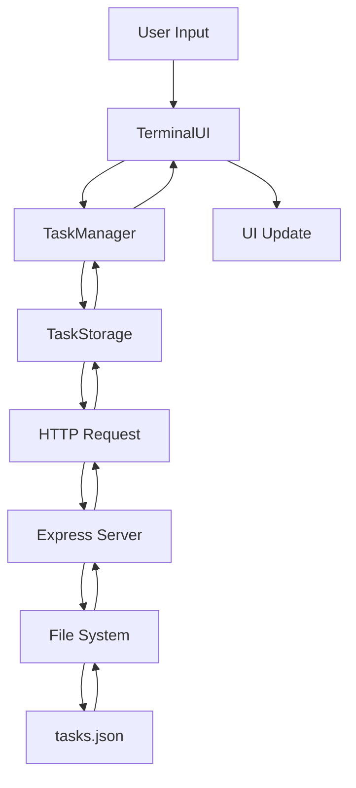

# 🏗️ Архітектура системи

## Огляд

Retro Console Task Manager - це full-stack веб-додаток, побудований на архітектурі клієнт-сервер з файловою базою даних.

## Технологічний стек

### Backend
- **Node.js** - Серверне середовище виконання
- **Express.js** - Веб-фреймворк
- **CORS** - Підтримка крос-доменних запитів
- **File System** - Робота з файловою системою

### Frontend
- **Vanilla JavaScript** - Без фреймворків для максимальної швидкості
- **CSS3** - Сучасні стилі з ретро естетикою
- **HTML5** - Семантична розмітка

### DevOps
- **Docker** - Контейнеризація
- **Docker Compose** - Оркестрація контейнерів
- **Nodemon** - Автоматичний перезапуск при розробці

## Архітектурні рішення

### 1. Модульна структура Frontend

```javascript
// Розділення відповідальності
├── managers/
│   └── TaskManager.js      # Бізнес-логіка управління завданнями
├── models/
│   └── Task.js            # Модель даних завдання
├── storage/
│   └── TaskStorage.js     # Абстракція роботи з API
└── terminal/
    └── TerminalUI.js      # UI компонент терміналу
```

### 2. RESTful API Design

```javascript
// Стандартні HTTP методи
GET    /api/tasks           # Отримати всі завдання
POST   /api/tasks           # Створити завдання
PUT    /api/tasks/:id       # Оновити завдання
DELETE /api/tasks/:id       # Видалити завдання
```

### 3. Файлова база даних

```json
{
  "tasks": [...],           // Масив завдань
  "metadata": {             // Метадані для оптимізації
    "totalTasks": 0,
    "completedTasks": 0,
    "lastModified": "..."
  }
}
```

## Потік даних



## Безпека

### Валідація даних
- Перевірка типів на клієнті та сервері
- Санітизація вводу користувача
- Обмеження довжини рядків

### Обробка помилок
- Централізована обробка помилок
- Логування помилок на сервері
- Дружні повідомлення для користувача

## Продуктивність

### Оптимізації
- Мінімальні HTTP запити
- Кешування метаданих
- Ледаче завантаження компонентів

### Масштабування
- Горизонтальне масштабування через Docker
- Можливість міграції на реальну БД
- Підтримка CDN для статичних файлів

## Розширюваність

### Плагіни
Система спроектована для легкого додавання нових команд:

```javascript
// Додавання нової команди
TerminalUI.addCommand('mycommand', {
    description: 'My custom command',
    handler: (args) => { /* logic */ }
});
```

### Теми
Підтримка кастомних тем через CSS змінні:

```css
:root {
    --primary-color: #00ff00;
    --background-color: #000000;
    --font-family: 'Courier New';
}
```

## Тестування

### Структура тестів
```
tests/
├── unit/           # Юніт тести
├── integration/    # Інтеграційні тести
└── e2e/           # End-to-end тести
```

### Покриття
- Мінімум 80% покриття коду
- Тестування всіх API endpoints
- Тестування UI компонентів

## Моніторинг

### Логування
- Структуроване логування (JSON)
- Різні рівні логів (error, warn, info, debug)
- Ротація логів

### Метрики
- Час відповіді API
- Кількість активних користувачів
- Помилки та їх частота

## Розгортання

### Середовища
1. **Development** - Локальна розробка з hot reload
2. **Staging** - Тестове середовище
3. **Production** - Продакшн з оптимізаціями

### CI/CD Pipeline
```yaml
# GitHub Actions приклад
name: Deploy
on: [push]
jobs:
  test:
    runs-on: ubuntu-latest
    steps:
      - uses: actions/checkout@v2
      - run: npm test
  deploy:
    needs: test
    runs-on: ubuntu-latest
    steps:
      - run: docker build -t app .
      - run: docker push registry/app
```

## Майбутні покращення

### Короткострокові
- [ ] Підтримка тегів для завдань
- [ ] Пошук та фільтрація
- [ ] Експорт в різні формати

### Довгострокові
- [ ] Багатокористувацький режим
- [ ] Синхронізація між пристроями
- [ ] Мобільний додаток
- [ ] Інтеграція з календарями